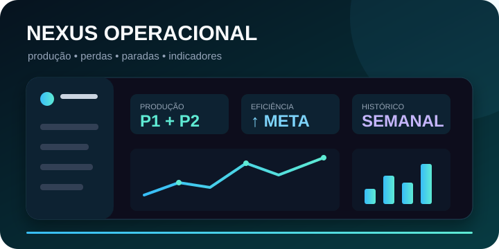
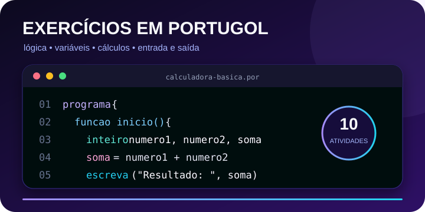
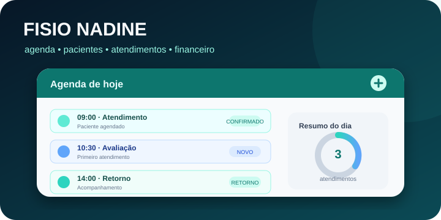
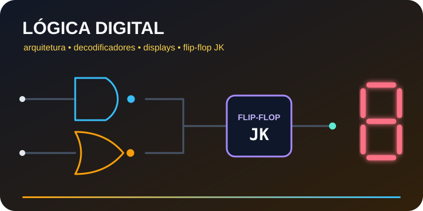
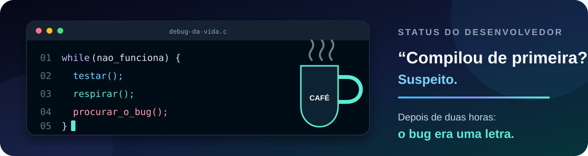

<div align="center">



<br>

<a href="mailto:rafael.rfl0900@gmail.com"></a>
<a href="https://br.linkedin.com/in/rafael-cornelius-85baba3a2"></a>
<a href="https://github.com/Rafael-Cornelius?tab=repositories"></a>

</div>

## Sobre mim

Sou estudante de **Engenharia de Software na UniCesumar**, em Maringá–PR, e atuo em um ambiente administrativo ligado à produção. Minha experiência une **controle de processos, organização de dados, análise operacional e melhoria de rotinas**.

Na tecnologia, construo uma base prática em **C, SQL/MySQL, HTML, CSS, Git/GitHub e Excel avançado**. Estou aprendendo **Python** com foco em automações úteis e em soluções que transformem dados e processos reais em sistemas claros.

```text
Formação       Engenharia de Software — UniCesumar (2026–2031)
Atuação        Processos produtivos, dados, controles e apoio administrativo
Base técnica   C, SQL, MySQL, HTML, CSS, algoritmos e lógica
Ferramentas    Git, GitHub, VS Code, Excel avançado e Microsoft Office
Aprendendo     Python, automação e organização de software
Objetivo       Estágio em Software, TI, Desenvolvimento, Dados ou Automação
```

> Não quero apenas acumular tecnologias. Quero compreender problemas, construir soluções, testar limites, corrigir falhas e documentar a evolução.

## Tecnologias e ferramentas

<div align="center">

### Conhecimentos atuais


### Em desenvolvimento


</div>

## Projetos em destaque

<table>
  <tr>
    <td width="50%" valign="top">
      <a href="https://github.com/Rafael-Cornelius/nexus-operacional">
        
      </a>
      <h3>⚙️ Nexus Operacional</h3>
      <p>Solução em evolução para comparar produção planejada e realizada, registrar paradas e perdas e acompanhar indicadores semanais e mensais.</p>
      <p><strong>Competências:</strong> análise de processos, Excel avançado, dados, dashboards, rastreabilidade e automação.</p>
      <a href="https://github.com/Rafael-Cornelius/nexus-operacional">Ver projeto →</a>
    </td>
    <td width="50%" valign="top">
      <a href="https://github.com/Rafael-Cornelius/exercicios-portugol">
        
      </a>
      <h3>🧠 Exercícios em Portugol</h3>
      <p>Coleção organizada de atividades sobre variáveis, entrada e saída, operações, porcentagens, geometria e conversões.</p>
      <p><strong>Competências:</strong> fundamentos, raciocínio lógico, nomes descritivos e documentação.</p>
      <a href="https://github.com/Rafael-Cornelius/exercicios-portugol">Ver exercícios →</a>
    </td>
  </tr>
  <tr>
    <td width="50%" valign="top">
      <a href="https://github.com/Rafael-Cornelius/fisio_nadine">
        
      </a>
      <h3>🩺 Fisio Nadine</h3>
      <p>Protótipo voltado à rotina de fisioterapia, explorando agenda, pacientes, atendimentos e controle financeiro simples.</p>
      <p><strong>Competências:</strong> análise de fluxo, organização de interface e solução orientada ao usuário.</p>
      <a href="https://github.com/Rafael-Cornelius/fisio_nadine">Ver protótipo →</a>
    </td>
    <td width="50%" valign="top">
      <a href="https://github.com/Rafael-Cornelius/arquitetura.logisin">
        
      </a>
      <h3>🔌 Lógica Digital</h3>
      <p>Experimentos acadêmicos com arquitetura de computadores, decodificadores, displays, somadores e flip-flop JK.</p>
      <p><strong>Competências:</strong> circuitos digitais, lógica binária e fundamentos de hardware.</p>
      <a href="https://github.com/Rafael-Cornelius/arquitetura.logisin">Arquitetura</a> ·
      <a href="https://github.com/Rafael-Cornelius/decodificador">Decodificador</a> ·
      <a href="https://github.com/Rafael-Cornelius/flip_flop_jk-simples">Flip-flop JK</a>
    </td>
  </tr>
</table>

## Painel de evolução

| Base consolidada | Aplicação prática | Próximos passos |
|---|---|---|
| C, HTML, CSS, SQL/MySQL e lógica | Exercícios, consultas, Git e documentação | Python, automações e projetos integrados |
| Excel avançado, dados e processos | Nexus Operacional e análise produtiva | Interfaces, testes e organização de software |
| Git, GitHub e VS Code | Versionamento e histórico de evolução | Fluxos colaborativos e qualidade de código |

A frequência de estudos pode ser acompanhada no [gráfico oficial de contribuições](https://github.com/Rafael-Cornelius?tab=overview), sem depender de serviços externos que podem deixar de carregar.

## O que estou desenvolvendo agora

- Prática de lógica e programação em C.
- Consultas e fundamentos de bancos de dados com SQL/MySQL.
- Aprendizado progressivo de Python voltado à automação.
- Evolução do Nexus Operacional com foco em dados, produção, perdas e indicadores.
- Organização de repositórios, documentação e versionamento com Git.
- Uso responsável de inteligência artificial como apoio ao desenvolvimento e à revisão.

## Bastidores de quem está aprendendo 😅

<div align="center">



<sub>Confiança para começar: 100% · certeza sobre o bug: em processamento.</sub>

</div>

<details>
  <summary><strong>Princípios que quero mostrar em cada projeto</strong></summary>
  <br>

  - Clareza sobre o problema que o projeto tenta resolver.
  - Honestidade sobre limitações e tecnologias em estudo.
  - Histórico de evolução por meio de commits e documentação.
  - Organização suficiente para que outra pessoa consiga compreender o projeto.
  - Disposição para testar, revisar, corrigir e melhorar continuamente.

</details>

---

<div align="center">

### Vamos construir algo que faça sentido?

Estou aberto a oportunidades de estágio em **Engenharia de Software, TI, Desenvolvimento, Dados e Automação**.

<a href="mailto:rafael.rfl0900@gmail.com"><strong>rafael.rfl0900@gmail.com</strong></a>
&nbsp;•&nbsp;
<a href="https://br.linkedin.com/in/rafael-cornelius-85baba3a2"><strong>LinkedIn</strong></a>

<br><br>

<sub>Construindo conhecimento com prática, constância e propósito.</sub>

</div>
